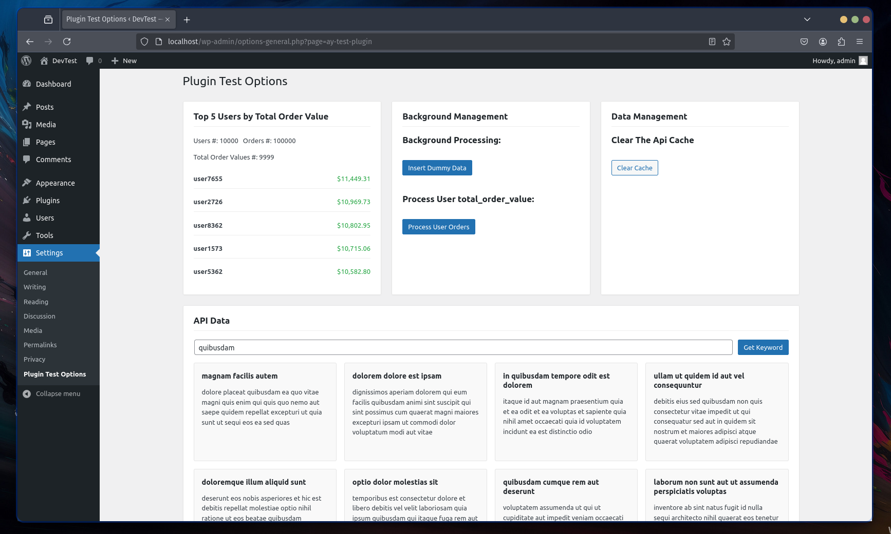

# Screenshot

  

  

# Watch the Video

## How to install the plugins
1. git clone or download the repo zip into wordpress directory or import it using the dashboard
	- wp-content/plugins/top-users-block
	- wp-content/plugins/ay-test-plugin
2. Login to a testing/dev WordPress, *important, please don't try on a production server* 
3. Navigate to Plugins >> installed plugins
4. Activate the plugins
5. Test the Gutenberg block from the a Post or a Page
6. Test the main plugin from Settings > Plugin Test Option

## Data Insertion and Transformation
- I included two version of the data processing functionality:
1. using an optimized quries to run over the database using the assumed data provided (fast and can be faster if optimized for system resources"
	- ├── background-processes
│   ├── class-sql-dummy.php
│   ├── class-sql-processor.php
│   └── dummy.sql
2. using the WordPress availble APIs to insert/process the data  on a queue one by one (slow)
 - ├── slow-background-process-classes
│   ├── class-dummy-process.php
│   └── class-wp-tov-processor.php

## Notes
- This Code follows the instructions provided in the mail but could be improved by implementing more especialized tools, for caching or for queuing
- 